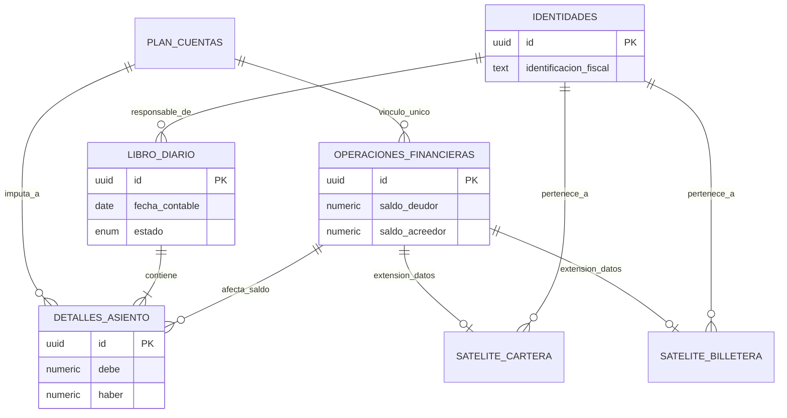
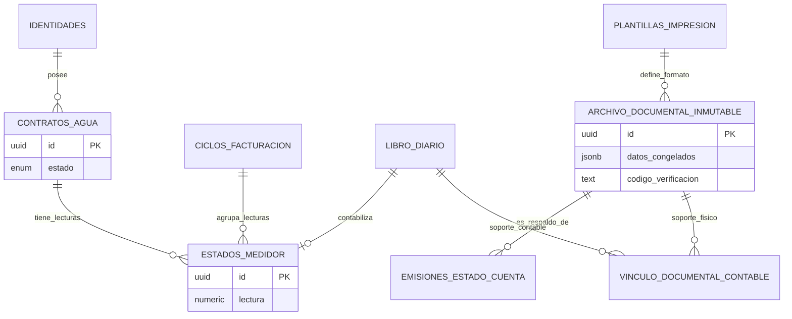

# Yaku-Sys: Core Financiero y ERP Transaccional

**Autoría y Diseño:** Jefferson.  
*Sistema de gestión financiera y servicios básicos de grado producción bajo arquitectura de integridad absoluta.*

---

## 💧 Resumen Ejecutivo
**Yaku-Sys** es un ecosistema ERP diseñado para la gestión crítica de servicios públicos y recaudación. A diferencia de los sistemas tradicionales donde la lógica reside en el Frontend o Backend, Yaku-Sys implementa un modelo de **Base de Datos como Controlador de Lógica (Smart Database Pattern)**. 

El sistema garantiza una **integridad financiera inquebrantable** mediante el uso de disparadores (triggers) de nivel de base de datos que validan la partida doble, bloquean la eliminación de datos y automatizan la amortización de deuda, garantizando que el estado financiero sea consistente, incluso ante fallos catastróficos en las capas superiores.

---

## 🛠 Stack Tecnológico
* **Database:** PostgreSQL 15+ (Lógica de negocio encapsulada mediante `SECURITY DEFINER`).
* **Seguridad:** Supabase (Auth, RLS, Storage).
* **Capa de Lógica:** PL/pgSQL (Motores reactivos, validadores de negocio).
* **Integridad:** TypeScript (Tipado estricto en el consumo de APIs).
* **Arquitectura:** Diseño de "Muñeca Rusa" (Nodos financieros jerárquicos).

---

## 🏛 Pilares Arquitectónicos

### 1. Integridad Defensiva (Zero Trust Database)
El esquema `privado` está estrictamente blindado. Ninguna entidad externa (usuarios o apps) tiene acceso directo a las tablas. El acceso se realiza exclusivamente a través de funciones RPC controladas, asegurando:
* **Inmutabilidad Radical:** No existen comandos `DELETE`. La historia financiera es intocable (Append-Only).
* **Defensa en Profundidad:** Políticas RLS y triggers de "Lockdown" bloquean cualquier intento de manipulación directa.

### 2. Contabilidad de Partida Doble (Hardened Ledger)
* **Triggers de Validación:** Todo asiento contable es validado por `trg_check_partida_doble`. Un asiento descuadrado es rechazado instantáneamente a nivel de kernel (`ERR-CONT-001`).
* **Anti-Backdating:** Candado temporal que impide movimientos retroactivos tras la ejecución de un cierre fiscal auditado.

### 3. Motores Reactivos (Reactive Financial Motors)
El sistema ejecuta acciones complejas de forma autónoma:
* **Auto-Amortización:** La inyección de capital en la cuenta `ANTICIPO` despierta el `tf_motor_recaudacion_reactiva`, el cual liquida las deudas pendientes (FIFO) sin intervención humana.
* **Auto-Facturación:** Generación de cargos y multas automatizada mediante algoritmos de monitoreo de mora.

### 4. Cadena de Bloques Documental
Cada documento (Estado de Cuenta, Factura, Acuerdo) se congela en formato `JSONB` dentro de `archivo_documental_inmutable`. Esto crea un vínculo indisoluble y auditable entre el archivo físico, su representación contable y el ciclo fiscal correspondiente.

---

## 📊 Arquitectura de Datos (ERD Modular)

Para mantener la legibilidad de la arquitectura, el modelo se divide en sus dos motores principales:

### Motor Financiero y Partida Doble
Gestiona la contabilidad estricta y los saldos rodantes de los clientes.

### Motor Operativo y Cadena Documental
Controla el ciclo de vida del servicio de agua, la facturación y la inmutabilidad de los comprobantes.

---

## 🚀 Despliegue (Migraciones)
El orden de ejecución de las migraciones es estrictamente secuencial para garantizar la integridad de las llaves foráneas (Foreign Keys) y la compilación de funciones:

1. `01_base/`: Inicialización del motor, esquemas y tipos de datos (Enums).
2. `02_tablas/`: Definición del core estructural (Identidades, Financiero, Operación, Documentos).
3. `03_conexiones/`: Inyección de restricciones de integridad (FKs).
4. `04_vistas/`: Capa de inteligencia financiera y tableros.
5. `05_logica/`: Instalación del motor de APIs, triggers y lógica de negocio pura.
6. `06_seguridad/`: Activación del "Lockdown" y candados financieros.
7. `07_seeds/`: Inicialización del catálogo legal y variables de entorno del sistema.

---

## 🛡 Consideraciones de Auditoría
* **Trazabilidad de Actores:** Toda mutación en el sistema está firmada por el UUID de la identidad que ejecuta la transacción.
* **Cierre de Ciclos Atómico:** Los cierres mensuales son transacciones atómicas que generan la facturación, calculan la morosidad y emiten los documentos inmutables simultáneamente, cerrando el periodo para prevenir alteraciones.

---

© 2026 Jefferson - Todos los derechos reservados.  
*Diseño y arquitectura protegidos por acuerdos de confidencialidad.*
